# Emotion-Classification-System
A project using CNN, SVM, Random Forest, Decision Tree to classify different kinds of emotions based on more than 13000 photos.

##	1. Introduction
The aim of our project was to utilize the data provided in the GitHub emotion dataset and build different models trying to make good prediction. We experimented with a number of machine learning algorithms like SVM, random forest and CNN. We find CNN performs best in this experimentation. Finally, the training accuracy is 91.18% and the test accuracy is 87.17%.
##	2. Data explore:
### 2.1	Basic info
The dataset contains 8 types different emotions: 'anger', 'sadness', 'disgust', 'neutral', 'happiness', 'contempt', 'surprise', 'fear'.
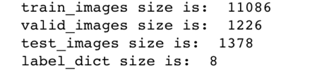
nearly all the pictures have 350 * 350 * 3 pixels, so each feature of the picture is 367500.
### 2.2	Class Distribution Imbalance

The data seems so imbalance, because most of the emotions are 'neutral' and 'happiness', and they are 90% emotions in the whole dataset. So even this is a multi-label classification problem, but the key point is to classify the 'neutral' and 'happiness' classes.
## 3. Data preprocessing:
Because the size of 367500 features is so difficult for us to train using the normal machine learning algorithms. So we came up with an idea by using pre-trained CNN to extract the high-level feature in low dimension and reuse these features to train different models.
In Keras, we used VGG16 Net which has been pre-trained by ImageNet dataset which is so huge. We used the last layer which contains 512 nodes as the output as our new feature. So all the following model can just use the “essence” of the pictures to train model.
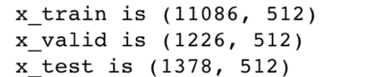

## 4.Models:
### 4.1	CNN
#### 4.1.1 Model Training and Testing
Because the data is so imbalance, so it is very easily overfitting. So we use some techniques in this training process.
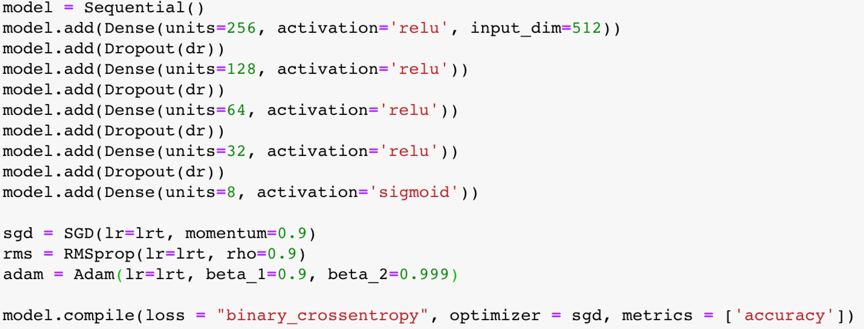
1.	Add dropout layers and make dropout rate large
2.	Use small learning rate to make it easily step into convergence
3.	Use binary cross entropy. Because we want to penalize each output node independently. So we pick a binary loss and model the output of the network as an independent Bernoulli distributions per label. At first, we used categorical cross entropy loss which is so easily be overfitting or just stop in a non-learning process.
When using categorical cross entropy:
- 1)	non-learning process:
dropout rate: 0.7, SGD(lr=1e-4, momentum=0.9)
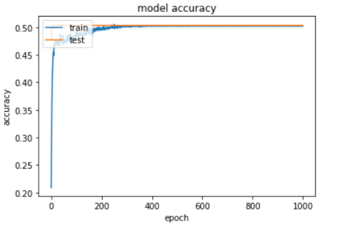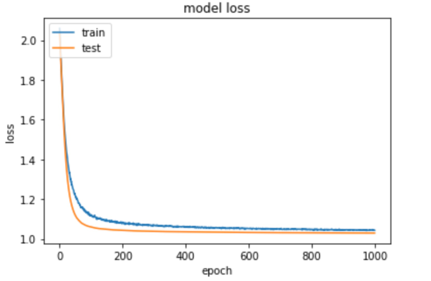
- 2)	overfitting:
dropout rate: 0.3, RMSprop(lr=1e-3, rho=0.9)
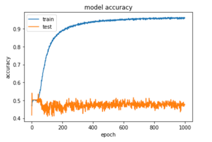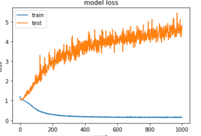
- 3) Final result:
dropout rate: 0.7, SGD(lr=1e-4, momentum=0.9)
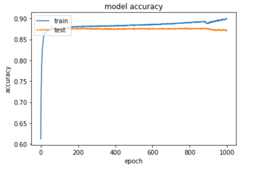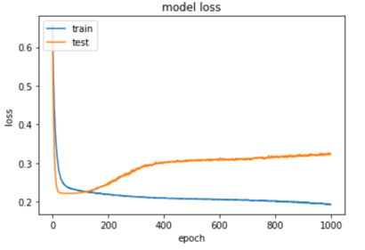
the accuracy on the test data is 87.17% finally.
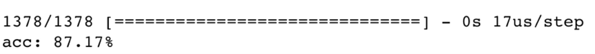
#### 4.1.2 Analyze:
As a result of we extract the high-level feature, we can easily use simple NN train the data and easily reach to convergence. In this process, the key point is to avoid overfitting, we can use dropout, normalize, regularization, and decrease learning rate to tune the model. CNN is definitely a so practical method for image classification in such a data and compute-power world.
### 4.2	SVM
To the SVM algorithms, the most important two hyperparameters are C and Gamma. Before training the model, we should tune the hyperparameters.
#### 4.2.1	Hyperparameter tuning
After careful consideration, we set the iteration range of both two hyperparameters as below:
| Scale | data |
| ------ | ------ |
| Scale of C | -5, -3, -1, 1, 3, 5,7,9,11,13,15 |
| Scale of Gamma|-15,-13,-11,-9,-7,-5,-3,-1,1,3|
**Table (a). Scale of C and Gamma for SVM Model**

After that we processed the scale of C and Gamma using the method:

`2 ** i for i in C/Gamma Scale`

We can get the final processed scale of C and Gamma as follows:
| Scale | data |
| ------ | ------ |
| Scale of C | 0.03125, 0.125, 0.5, 2, 8, 32, 128, 512, 2048, 8192, 32768 |
| Scale of Gamma|3.0517578125e-05,0.0001220703125,0.00048828125, 0.001953125, 0.0078125, 0.03125, 0.125, 0.5, 2, 8|
**Table (b). Processed Scale of C and Gamma for SVM model**

- Grid Search Iteration of the Scales

With GridSeachCV method provided by sklearn package, we exhaustively considered all the combinations of C and Gamma candidates in table (b) to find the best parameters for the model.
After computing, we get the best hyperparameters as follows:
| Parameter | result |
| ------ | ------ |
| C | 0.03125 |
| Gamma|3.0517578125e-05|
**Table \(c\). Final C and Gamma for SVM Model Training**
#### 4.2.2	Model Training and Testing
We used the hyper parameters got in tuning to train the SVM based on the training dataset. Then we test the model on the validation set. Finally, we test the model on the test dataset. After thorough comparison, we chose tried linear, polynomial and rbf as SVM kernels, and ovo as decision function.
#### 4.2.3	Analysis
By trying different parameters like C, gamma and kernel. We found that classifiers with almost all kinds of combination lead to the same result in training, validation and testing. It is because that SVM is initially design for binary classification, and this is a multiclass classification problem. We are using ovo, which means one vs one, binary. Thus, we found that SVM may not be so suitable for this task. And the result shows that the accuracy on the data is not so satisfying.
After some research, we found that there are three schemes to solve multiclass problem. They are ovr(one vs rest), M(M-1)/2 classifier and extending the formulation of SVM. They are complicated and their results may not be as other simpler methods(2).
### 4.3	Decision Tree
For Decision Tree, the most significant parameters in the decision tree algorithm are max_depth. Other parameters including min_samples_split, min_sample_leaf, max_leaf_nodes also have some influence on the result.
#### 4.3.1	Parameter tuning
First step: go through different max_depth settings from 2 to 40. We figured out the data is overfitting. The training accuracy reaches 99.9% after depth 25, but the validation and test data’s accuracy are very low, just as the pictures shows below.
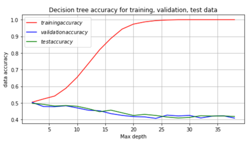
Second step: Adjust parameters including minParent and minLeave to reduce overfitting. After tuning different kinds of combination, we got a result as follows. We can get the highest train accuracy with maxmium depth and highest validation & test accuracy with the lowest depth.

| | Train data | Validation data | Test data |
| ------ | ------ | ------ | ------ |
|  Highest train accuracy| 0.999 | 0.449 | 0.460 |
| Highest validation & test accuracy|0.504| 0.503 |0.497 |
4.3.2	Analysis
Decision Tree will first choose to make decisions based on features with the largest information gain. The data is imbalance and the decision fail to make right decisions will few features trained for the minority data points and thus caused the overfitting.
### 4.4	Random Forest
#### 4.4.1	Parameter tuning
- (1)	First step: find best n_estimators and max_depth
The major parameter of random forest is n_estimators and max_depth. We first traverse different combinations of the tree numbers and max_depth.

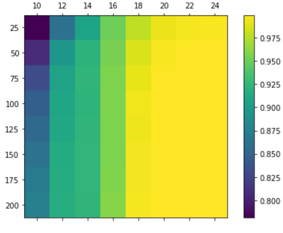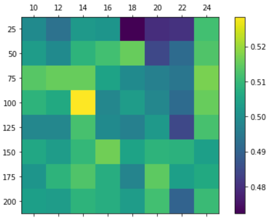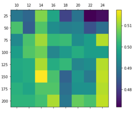

&nbsp;&nbsp;&nbsp;&nbsp;&nbsp;&nbsp;&nbsp;&nbsp;&nbsp;&nbsp;&nbsp;&nbsp;&nbsp;**Training data** &nbsp;&nbsp;&nbsp;&nbsp;&nbsp;&nbsp;&nbsp;&nbsp;&nbsp;&nbsp;&nbsp;&nbsp;&nbsp;&nbsp;&nbsp;&nbsp;&nbsp;&nbsp;&nbsp;&nbsp;&nbsp;&nbsp;&nbsp;&nbsp; **validation data** &nbsp;&nbsp;&nbsp;&nbsp;&nbsp;&nbsp;&nbsp;&nbsp;&nbsp;&nbsp;&nbsp;&nbsp;&nbsp;&nbsp;&nbsp;&nbsp;&nbsp;&nbsp;&nbsp;&nbsp;&nbsp;&nbsp;&nbsp;&nbsp;&nbsp;&nbsp;&nbsp;&nbsp;&nbsp;&nbsp;&nbsp;**test data**

We can obtain the best training accuracy of 99.9% (depth is 24 and tree number 200), the best validation accuracy of 52.8%(depth 14 and tree number 100), the best test accuracy of 51.7%(depth 14 and tree number 150).
- (2) Second step: find the best max_features and tune the minParent and min Leaf. We realized this with GridSearchCV. Base the step1’s result. We use different kinds of max_features parameter settings including ‘sqrt’, ‘log2’ and None. We found out the log2 has better performace compared with others. By applying ‘log2’ for max_feature, we enhanced the validation accuracy to 53.1% and test accuracy to 52%.
### 4.4.2	Analysis
Random forest uses a vote mechanism to avoid overfitting in decision tree, it is one of the bagging algorithms. In this data set, the result turns out to be just slightly better than the result obtained by using decision tree. During tuning the parameter, in the validation data, we found most of the predict result falls to the ‘happiness’ (about 90%) and few of them fall to the ‘neutral’ (about 10%). In random forest, the error depends on the correlation between any two trees in the forest and the strength of each individual tree in the forest. [3] With major emotions concentrated on ‘happiness’. It is nearly impossible for trees with minority features to win over the ‘happiness’ since they are very less likely to be chosen while constructing the decision trees and the trees in the random forest are highly correlated with each other. Potential methods to deal this problem are resampling the under-presented classes and generating synthetic samples. [4]
##5.	Final Conclusions
For SVM, we got 0.526 of accuracy on training data, 0.504 on validation data, and 0.304 on test data.
For Decision tree, we got 0.504 of accuracy on training data, 0.503 on validation data and 0.497 on test data.
For Random Forest, we got 0.924 of accuracy on training data, 0.531 on validation data and 0.517 on test data.
Finally, we decided that CNN seems to be the most accurate classifier which is not over-fitting and under-fitting at the same time. CNN gave us scores of 91.18% on the public training data and 87.17% on the test data.

## 6. References
- [1]https://www.depends-on-the-definition.com/guide-to-multi-label-classification-with-neural-networks/
- [2]J. P. Dubois, O. M. Abdul-Latif, SVM-Based Detection of SAR Images in Partially Developed Speckle Noise. International Journal of Computer and Information Engineering, Vol:1, No:12, 2007.
- [3]https://www.quora.com/How-does-bagging-avoid-overfitting-in-Random-Forest-classification
- [4] https://machinelearningmastery.com/tactics-to-combat-imbalanced-classes-in-your-machine-learning-dataset/
